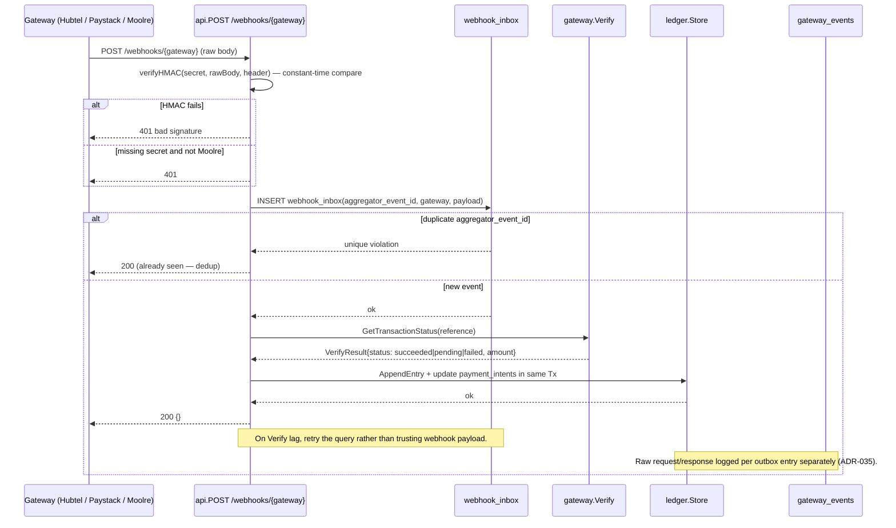
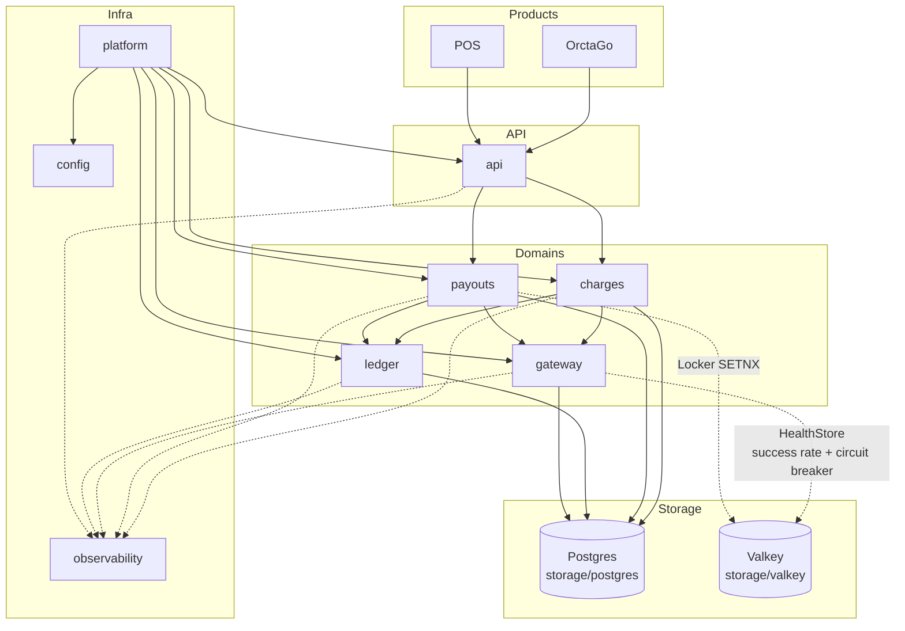
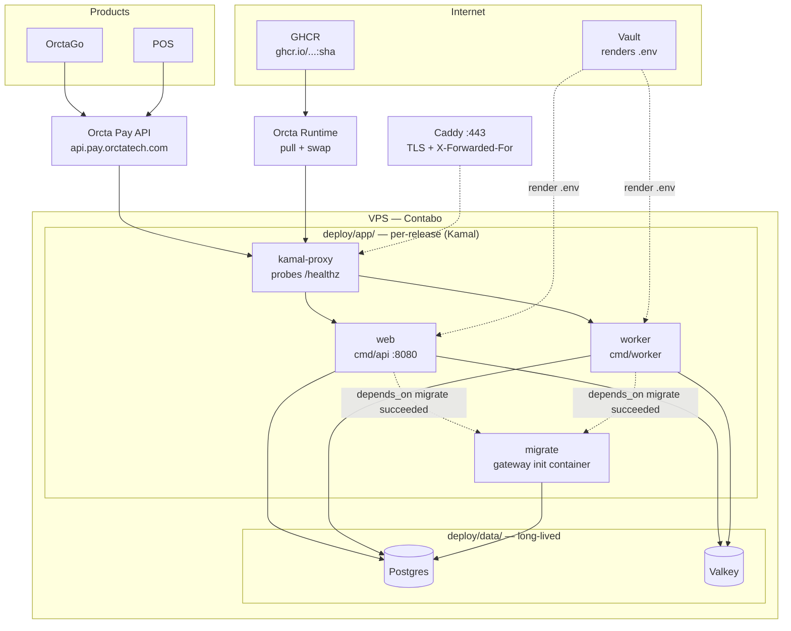

# Orcta Pay — Architecture

Status: **Draft v2** — service decomposition, request and webhook flows, ledger and reservation model, provider routing, deployment, and cross-cutting decisions locked. Open items tracked in §12.

Companion docs: [`CONVENTIONS.md`](./CONVENTIONS.md), [`docs/adr/0034-orcta-pay-service.md`](./docs/adr/0034-orcta-pay-service.md), [`docs/adr/0035-payments-outbox-reservation-ledger.md`](./docs/adr/0035-payments-outbox-reservation-ledger.md), [`architecture-diagrams.md`](./architecture-diagrams.md). This document assumes `CONVENTIONS.md` applies throughout. It restates those rules only where this service specializes them.

---

## 1. Guiding principle

Domain boundaries follow Parnas decomposition. A module exists to hide one design decision likely to change on its own.

The question running through this document is: what secret does this package hide, and what else changes on the same timeline?

Concretely:

- A gateway adapter hides a provider's HTTP shape and auth header. It changes when Hubtel or Moolre changes their API, not when payout policy changes.
- `charges` hides collection lifecycle and reference generation. `payouts` hides reservation before disbursement. They change on different triggers (per-request vs scheduled batch).
- `ledger` hides double-entry and three-timestamp bookkeeping. It changes when accounting policy changes, not when a gateway is swapped.
- Dependencies point one direction. A domain package declares the interface it needs. The storage implementation satisfies it implicitly (per `CONVENTIONS.md` §3.1).

---

## 2. Domain map

```bash
charges   payouts   gateway   ledger
api   storage   observability   config   platform
```

| Package | Secret it hides | Depends on (via interfaces it defines) |
| --- | --- | --- |
| `charges` | Collection lifecycle and `optd-{product}-{gateway}-{ulid}` generation | `gateway` (`AggregatorClient`), `ledger` (append on confirm) |
| `payouts` | Batch disbursement and reservation before payout | `gateway` (`Payout`), `ledger` (`Reservation` + `AppendEntry`) |
| `gateway` | Provider selection, ranking via Valkey, and per-gateway HTTP shape | `storage/valkey` via `HealthStore` (success rate, circuit breaker) |
| `ledger` | Double-entry, append-only, three timestamps per entry | `storage/postgres` via `Store` |
| `api` | HTTP translation: chi router, DTOs, middleware, webhook verification | `charges`, `payouts` (thin, nothing depends on it) |
| `storage/postgres` | SQL execution (sqlc + pgx) and transaction boundaries | — (satisfies domain interfaces) |
| `storage/valkey` | Rolling health metrics, circuit breaker, `SETNX` locks | — (satisfies domain interfaces) |
| `observability` | `log/slog` + OTel + Prometheus glue behind context accessors | — (consumed by everyone, depends on nothing domain-specific) |
| `config` | Env parsing + validation, fails fast on startup | — |
| `platform` | Composition root — builds the full dependency graph for `cmd/*` | All of the above |

**Explicitly not a package:** `checkout` or `orders`. Those live in OrctaGo. Orcta Pay is product-agnostic. It receives `product` as a field on every request and never imports product logic.

**Why four domain packages and not one `payments`:** `charges` is request-driven and must be low-latency. `payouts` is schedule-driven and must be resumable. `gateway` is provider-driven and must be swappable per `PAYMENTS_PRIMARY`. `ledger` is accounting-driven and must be immutable. They change on different timelines and serve different callers.

---

## 3. Folder structure

```bash
cmd/
  api/              # HTTP server entrypoint — thin: parse config, wire deps, run() error
  worker/           # background jobs: outbox drain, payout dispatch, reconciliation —
                    # ticker + select on ctx.Done()

internal/
  charges/          # ChargeRequest, ChargeResult (sealed), Service.Initiate + Status
  payouts/          # PayoutBatch, Service.Create + Dispatch, reservation-before-payout
  gateway/          # AggregatorClient (Initiate/Verify/Refund/Payout), Hubtel/Moolre/Paystack adapters
                    # ChargerRouter (ranking), reference.go (optd-... ULID)
  ledger/           # LedgerEntry, Reservation, Service.RecordCollection + ConfirmSettlement

  api/              # chi router, handlers, webhooks, DTOs — depends inward, nothing depends on it

  storage/
    postgres/       # sqlc-generated code, implements domain-defined interfaces
      queries/      # payment_intents.sql, gateway_events.sql, ledger_entries.sql, payout_reservations.sql, webhook_inbox.sql
    valkey/         # gateway_health.go, locks.go — implements gateway.HealthStore / payouts.Locker

  money/            # Money type — integer pesewas, never float (see §6)

  observability/    # log/slog + OTel + Prometheus glue — LoggerFromContext, StartSpan, WideEvent
                    # so domain packages never import a telemetry vendor directly

  config/           # env parsing + validation, fails fast on startup
  platform/         # composition root — builds the full dependency graph for cmd/*

api/
  openapi.yaml      # wire contract — source of truth for POST /v1/charges, /v1/payouts, /webhooks/*
  spec.go           # embedded spec bytes

migrations/         # SQL migrations (golang-migrate), one SET LOCAL lock_timeout = '3s' per file
deploy/
  app/              # docker-compose.yml for web + worker + migrate (Kamal release)
  data/             # docker-compose.yml for Postgres + Valkey (long-lived)
```

**Deliberately excluded:** `models/` or `common/` grab-bags. A cross-domain value type gets its own narrow package (`internal/money`) only when stable and shared across three or more call sites.

---

## 4. Request flow and webhook flow

One idea per sentence. Two flows cover the service.

### 4.1 Charge request flow

Product calls `POST /v1/charges` with `product`, `amount_pesewas`, and `wallet` or `phone`.

```mermaid
sequenceDiagram
    participant Product as Product (Go / POS)
    participant API as api (chi)
    participant Charges as charges.Service
    participant Router as gateway.ChargerRouter
    participant Store as storage/postgres
    participant Gw as gateway adapter
    participant Valkey as Valkey (HealthStore)
    participant Ledger as ledger

    Product->>API: POST /v1/charges {product, amount_pesewas, wallet}
    API->>Charges: Initiate(ChargeRequest)
    Charges->>Charges: validate(product, amount > 0, wallet/phone)
    Charges->>Store: FindByIdempotencyKey(product, key) — if found, return existing ref
    Charges->>Router: Route(ctx) — ranked by HealthStore
    Router->>Valkey: IsCircuitOpen(g) per gateway
    Valkey-->>Router: open/closed
    Router-->>Charges: ordered gateways [primary, fallback, ...]
    Charges->>Charges: BuildReference(product, gateway, NewULID()) → optd-...
    Charges->>Store: CreateIntent(ref, product, gateway, amount)
    Charges->>Gw: Initiate(InitiateRequest{Reference: ref, Amount, Wallet})
    Gw-->>Charges: InitiateResponse{ExternalRef, RawRequest, RawResponse}
    Charges-->>API: ChargePending{Ref, Gateway, ExternalRef}
    API-->>Product: 201 {ref, gateway, status: pending, external_ref}
    Note over Gw,Store: Gateway event raw payload persisted per ADR-035; verify is separate.

    Product->>API: GET /v1/charges/{ref}/status
    API->>Charges: Status(ref)
    Charges->>Gw: Verify(ref) — authoritative truth
    Gw-->>Charges: VerifyResult{Status, Amount, VerifiedAt}
    Charges-->>API: VerifyResult
    API-->>Product: 200 {ref, status, verified_at}
```

The intent is durable before the gateway call. A crash between commit and dispatch cannot lose the charge. Retries reuse the same `optd-...` reference.

`GET /v1/charges/{ref}/status` calls `Verify` directly. Products poll this when a webhook has not yet arrived.

### 4.2 Webhook flow

One endpoint per gateway. Product attribution stays in Orcta Pay.



Webhook is a trigger, not truth. `GetTransactionStatus` is truth. Duplicate deliveries return 2xx without reprocessing.

Per-provider signature detail lives in the comparison table in §10.

---

## 5. Package dependency graph

A solid arrow means "calls into, via an interface the source declares." A dotted arrow marks Valkey-mediated ranking.



**What this makes visible:** `gateway` is the only package that talks to the outside world. `charges` and `payouts` never touch HTTP directly. `ledger` never imports `gateway`. `api` is a thin translation layer with no dependents. `charges` and `payouts` declare the interfaces that `storage/postgres` and `storage/valkey` satisfy. If a future change makes `charges` import `payouts` or `ledger` import `gateway`, that is worth noticing.

---

## 6. Money representation

Amounts are stored as integer minor units (pesewas). They are never floats.

```go
// internal/money/money.go
type Currency string

const GHS Currency = "GHS"

type Money struct {
    minorUnits int64   // unexported — forces construction through this package
    currency   Currency
}

func New(pesewas int64, currency Currency) Money { ... }
func (m Money) Add(other Money) (Money, error)   { ... } // errors on currency mismatch
func (m Money) IsNegative() bool                 { ... }
func (m Money) IsZero() bool                     { ... }
func (m Money) MinorUnits() int64                { ... } // for persistence only
```

The unexported field is the design decision. It prevents float math from leaking into any caller. `money.Money` flows between `charges`, `payouts`, `gateway`, and `ledger`. It is unwrapped to `int64` only at the Postgres column boundary or the JSON API boundary. Gateway wire formats diverge — Paystack expects pesewas, Hubtel and Moolre expect decimal GHS strings — and that conversion lives inside each adapter, not in callers.

---

## 7. Reference scheme

Every intent gets `optd-{product}-{gateway}-{ulid}` at creation.

| Segment | Value | Example |
| --- | --- | --- |
| `optd` | Fixed prefix — Orcta Pay namespace | `optd` |
| `{product}` | Calling product slug, dash-safe | `orctago`, `pos` |
| `{gateway}` | Chosen gateway | `hubtel`, `paystack`, `moolre` |
| `{ulid}` | 26-char Crockford Base32 ULID (time-ordered) | `01K5...` |

Full reference example: `optd-orctago-moolre-01K5J8T9XYZ...`.

Generated at intent creation and passed as `reference` / `clientReference` / `externalref` on every attempt, including retries and fallback. The same reference survives `ChargerRouter` failover. It is stored in `payment_intents.ref` and unique on `(product, idempotency_key)` for product-level idempotency. `gateway.ParseReference` recovers `product`, `gateway`, and `ulid` for routing `Status` to the correct adapter.

`idempotency_key` is optional on `POST /v1/charges`. When supplied, the same `(product, idempotency_key)` returns the existing intent without creating a new one. When omitted, a fresh ULID is generated every call.

For payouts, idempotency is scoped to `(vendor_id, batch_date)` per §8.3. The per-entry gateway reference reuses that scoped key so a resumed batch cannot double-pay.

---

## 8. Charges, payouts, and reservations

### 8.1 Charges

`charges.Service.Initiate` validates, checks idempotency, picks a gateway order from `ChargerRouter.Route`, builds the `optd-...` reference, persists the intent, then calls `AggregatorClient.Initiate`. A missing adapter or unconfigured gateway returns `ChargePending` with the ref so the intent remains findable for reconciliation.

`charges.Service.Status` parses the `optd-...` reference to recover the gateway and delegates to `AggregatorClient.Verify`. Products poll this endpoint when the webhook is delayed.

Interface:

```go
type IntentStore interface {
    CreateIntent(ctx context.Context, ref string, req ChargeRequest, gateway gateway.Gateway, amount money.Money) error
    FindByRef(ctx context.Context, ref string) (ChargePending, error)
    FindByIdempotencyKey(ctx context.Context, product, key string) (string, bool, error)
    UpdateStatus(ctx context.Context, ref string, status string) error
}
```

### 8.2 Payouts

`payouts.Service.Create` validates every entry amount, sums the total, truncates `batch_date` to UTC midnight, builds per-entry `optd-...` references, and persists the batch plus reservations in one linearizable transaction via `ReservationStore.CreateBatchWithReservations`. Outbox inserts are scoped to the same key so a crash after reservation cannot lose the dispatch.

`payouts.Service.Dispatch` drains the batch through `AggregatorClient.Payout` in ranked order, guarding each entry with a Valkey `SETNX` lock. On success it appends a `vendor_payout` ledger entry with three timestamps. On permanent failure it releases the reservation. `ErrNotConfigured` is a log-and-skip so local dev stays green.

Batch example via `POST /v1/payouts`:

```json
{
  "product": "orctago",
  "idempotency_key": "2026-08-31",
  "entries": [
    {"recipient": "0244123456", "amount_pesewas": 50000, "currency": "GHS"},
    {"recipient": "0554123456", "amount_pesewas": 32000, "currency": "GHS"}
  ]
}
```

### 8.3 Reservation model

`payout_reservations` rows move `open` → `settled` or `open` → `released`. Balance check and reservation creation occur in a single transaction. Two concurrent batch runs cannot pay the same funds twice. An `open` reservation past the threshold is a monitored condition, not a silent state.

```sql
payout_reservations   id, batch_id (FK), amount_pesewas, currency,
                      status (open|settled|released), recipient, reference, gateway,
                      settled_at, created_at
```

Constraints:

| Rule | Enforcement |
| --- | --- |
| Double-pay prevention | Reservation Tx + unique on `(product, batch_date, idempotency_key)` for batches |
| Negative balance representable | No `CHECK (balance >= 0)` on any derived view — reversal after payout is valid |
| Resumability | Resume dispatches only entries whose line has not yet succeeded |

---

## 9. Gateway — provider selection and adapters

### 9.1 Interface

```go
type AggregatorClient interface {
    Initiate(ctx context.Context, req InitiateRequest) (InitiateResponse, error)
    Verify(ctx context.Context, reference string) (VerifyResult, error)
    Refund(ctx context.Context, reference string, amount money.Money) error
    Payout(ctx context.Context, recipient string, amount money.Money, reference string) error
}
```

Three adapters satisfy it: `hubtel.go`, `paystack.go`, `moolre.go`. `ChargeResult` is a sealed interface (`ChargeSucceeded` / `ChargePending` / `ChargeFailed`) so callers handle every case exhaustively.

### 9.2 Routing and resilience

`ChargerRouter` ranks gateways by primary plus health. `PAYMENTS_PRIMARY` selects the preferred gateway. Valkey rolling metrics supply success rate and circuit breaker state. Circuit-open gateways are excluded from `Route`. If every gateway is open, the full ordered list is returned so the call still has a chance.

| Concern | Mechanism |
| --- | --- |
| Primary selection | `PAYMENTS_PRIMARY` env (`hubtel` / `paystack` / `moolre`) |
| Ranking | `HealthStore.SuccessRate` + `IsCircuitOpen` from Valkey |
| Failover | `InitiateWithFallback` tries ranked gateways in order |
| Timeout | Bounded timeout per HTTP call — no unbounded waits |
| Retry | Bounded exponential backoff on `RequiresRetry` / transient 5xx, ceiling tracked in outbox |
| Fallback on webhook timeout | `Verify` poll as backstop when webhook never arrives |

### 9.3 Provider comparison

| Dimension | Hubtel | Moolre | Paystack (Ghana) |
| --- | --- | --- | --- |
| Base URL | `https://payproxyapi.hubtel.com` | `https://api.moolre.com` (sandbox `https://sandbox.moolre.com`) | `https://api.paystack.co` |
| Amount on wire | Decimal GHS (`"50.00"`) | Decimal GHS string (`"120.00"`) | Integer pesewas (`50000` = GHS 500) |
| Idempotency key | `ClientReference` | `externalref` | `reference` |
| Auth | `Basic base64(clientId:clientSecret)` | `X-API-USER` + `X-API-PUBKEY` (collect) / `X-API-KEY` (transfer) | `Bearer sk_...` |
| Collections | `POST /receive/initiate` (MoMo USSD), `POST /items/initiate` (hosted) | `POST /open/transact/payment` (MoMo), `POST /embed/link` (hosted Web POS) | `POST /transaction/initialize` (hosted), `POST /charge` (headless MoMo) |
| Disbursement | `POST /send/money` | `POST /open/transact/transfer` (+ `POST /open/transact/validate` pre-check) | `POST /transferrecipient` then `POST /transfer` (bulk via `/transfer/bulk`) |
| Bulk payout | Not documented — confirm | Dashboard CSV; no batch API — loop single transfers | Bulk via `POST /transfer/bulk` (requires OTP disabled) |
| Webhook signature | Not published — confirm | Not published — use dedup + `Verify` | `x-paystack-signature` = `HMAC SHA512` over raw body |
| Verify endpoint | Confirm path (Transactions) | `POST /open/transact/status` | `GET /transaction/verify/:reference` |
| Sandbox | Confirm `sandbox.payproxyapi...` | `https://sandbox.moolre.com` | `sk_test_...` keys on same host |

Amounts are GHS unless noted. Internal money is integer pesewas (GHS × 100). Adapters handle the wire conversion. See `orcta-go-docs/docs/research/hubtel-moolre-paystack-deep-dive.md` for the full provider deep dive with source URLs.

---

## 10. Ledger

Double-entry, append-only, three timestamps per entry. No mutable balance column. Corrections are compensating entries, not edits.

| Timestamp | Meaning | When set |
| --- | --- | --- |
| `value_time` | Event occurred | At entry creation (order paid, commission earned) |
| `booking_time` | Recorded in Orcta Pay | At `AppendEntry` time |
| `settlement_time` | Funds moved at aggregator/bank | Null until `Verify` or reconciliation confirms; stamped by `SettleReservation` |

Collapsing these into one field would lose the ability to report against the period a transaction belongs to and to distinguish real activity from late corrections.

Tables:

| Table | Purpose |
| --- | --- |
| `ledger_entries` | General collection / commission rows with three timestamps |
| `vendor_ledger_entries` | Per-vendor rows, with `vendor_id` |
| `platform_commission_entries` | Platform take per order |
| `payout_reservations` | Reservation lifecycle for batch disbursement |
| `payout_batches` | Batch header with `batch_date` and `idempotency_key` |

Invariant for any closed period: `sum(debits + credits) + sum(platform_commission) + aggregator net = 0`. Reconciliation checks this.

```go
type LedgerEntry struct {
    ID             uuid.UUID
    Kind           EntryKind // collection | platform_commission | vendor_payout
    Ref            string    // optd-... reference
    Amount         money.Money
    ValueTime      time.Time
    BookingTime    time.Time
    SettlementTime *time.Time
    Product        string
    CreatedAt      time.Time
}
```

---

## 11. Outbox, webhook inbox, and reconciliation

### 11.1 Outbox

`gateway_events` and `payment_intents` form the charge outbox. Every `AggregatorClient` call also persists raw `raw_request` / `raw_response` per entry, separate from parsed `ChargeResult`, keyed to the intent.

| Table | Role | Key mechanism |
| --- | --- | --- |
| `gateway_events` | Per-attempt dispatch log | `FOR UPDATE SKIP LOCKED` polling (drain pending rows without blocking) |
| `payment_intents` | Intent with idempotency | `UNIQUE (product, idempotency_key)` |
| `webhook_inbox` | Deduplication on ingest | `PRIMARY KEY (aggregator_event_id)` — duplicate returns 2xx without reprocessing |
| `payout_batches` + `payout_reservations` | Batch reservation + batch idempotency | `UNIQUE (product, batch_date, idempotency_key) WHERE idempotency_key IS NOT NULL` |

Short-lived Valkey `SETNX` locks guard races between worker and manual retry.

### 11.2 Webhook inbox

Each gateway posts to its own endpoint:

| Endpoint | Header | Auth |
| --- | --- | --- |
| `POST /webhooks/hubtel` | `X-Hubtel-Signature` (expected) | HMAC SHA256, constant-time `hmac.Equal` |
| `POST /webhooks/paystack` | `X-Paystack-Signature` | HMAC SHA512 over raw body, per Paystack docs |
| `POST /webhooks/moolre` | None published | Dedup + `Verify` is source of truth |

Empty `WEBHOOK_SECRET` fails closed — verification rejects when the secret is not configured, except for Moolre where no signature is published and `webhook_inbox` dedup plus `Verify` is the correct check.

### 11.3 Reconciliation

A standing daily job pulls each aggregator's statement via its reporting API and diffs it against `ledger_entries` for the period. Mismatches alert and never auto-overwrite. The correction is a compensating entry, never an edit.

| Provider | Statement source | Window must account for |
| --- | --- | --- |
| Hubtel | Confirm reporting API / dashboard export | Confirm T+ |
| Moolre | `POST /open/account/status` type 2 (filter by date/status) | Daily settlement |
| Paystack | `GET /settlement` + `GET /settlement/:id/transactions` | T+1/T+2 business days |

---

## 12. Observability

Delivery debugging is forensic. Every domain package emits events as part of being built.

| Concern | Choice | Why |
| --- | --- | --- |
| Logging | `log/slog` JSON handler | Stdlib since Go 1.21. Stable and OTel-native. |
| Tracing | OpenTelemetry, OTLP export | A charge crosses `api → charges → gateway → ledger`. A trace answers "why pending" without stitching logs by hand. |
| Metrics | Prometheus at `/metrics` | Scraped, low overhead. |
| Stack | Prometheus + Loki + Tempo ("LGTM"), one Grafana | Self-hosted. OTel-native. One ecosystem. See `backend/ARCHITECTURE.md` §8.8. |
| Wide events | One structured event per request, every layer contributes | Pasted `trace_id` + `charge_ref` reconstructs the full call. |

Domain packages never import OTel or Prometheus directly. They use:

```go
ctx, span := observability.StartSpan(ctx, "charges.Initiate")
defer span.End()
observability.SetEventField(ctx, "charge_ref", ref)
observability.LoggerFromContext(ctx).InfoContext(ctx, "charge_initiated")
```

Every `ERROR` log has an alert attached. If it does not page someone, it is `WARN`.

---

## 13. API versioning and wire contract

URL path versioning (`/v1/...`), matching the backend's `ARCHITECTURE.md` §9. Additive-only changes within `v1`. A breaking change earns `v2`.

| Method | Path | Description |
| --- | --- | --- |
| `GET` | `/healthz` | Liveness — process is up |
| `GET` | `/readyz` | Readiness — Postgres + Valkey reachable |
| `GET` | `/metrics` | Prometheus exposition |
| `GET` | `/openapi.yaml` | Spec as YAML |
| `POST` | `/v1/charges` | Initiate a charge → `optd-...` pending |
| `GET` | `/v1/charges/{ref}/status` | Verify via `GetTransactionStatus` |
| `POST` | `/v1/payouts` | Create a batch with reservations |
| `POST` | `/webhooks/hubtel` | Hubtel webhook (HMAC, dedup) |
| `POST` | `/webhooks/paystack` | Paystack webhook (HMAC, dedup) |
| `POST` | `/webhooks/moolre` | Moolre webhook (dedup + Verify) |

`api/openapi.yaml` is the contract. A test fails when the served router and the spec disagree. Bodies are bounded by `internal/api.maxBodyBytes` (1 MiB) via `http.MaxBytesReader` and `json.Decoder.DisallowUnknownFields`.

---

## 14. Tech choices

| Decision | Pick | Why |
| --- | --- | --- |
| Router | `chi` | Matches reference implementation. Stdlib-compatible. No framework lock-in. |
| DB access | `sqlc` + `pgx` | Type-safe generated code from real SQL. No ORM reflection. |
| Migrations | `golang-migrate` | Single binary. pgx v5 driver. Lock support. |
| Config | Plain struct + manual env parsing, validated once at startup | Not at the scale where Viper earns its complexity. |
| Valkey access | Per-domain narrow interfaces (`gateway.HealthStore`, `payouts.Locker`) | A shared client everywhere recreates the coupling decomposition prevents. |
| Structured logging | `log/slog` JSON handler | Stdlib. Already required to accept `context.Context` everywhere. |
| Tracing | OpenTelemetry, OTLP export | One `trace_id` through `api → charges → gateway → ledger` replaces hand stitching. |
| Metrics + logs + traces | Prometheus + Loki + Tempo ("LGTM"), one Grafana | Self-hosted. OTel-native. Tempo + Loki correlate error grouping to `trace_id` with one fewer service than Sentry. |
| Gateway ranking | Valkey rolling success rate + circuit breaker | Config-driven fallback without code change. |

---

## 15. Deployment

Pull-based through Orcta Runtime. CI publishes one image to GHCR. A `registry_package` webhook fires. Orcta pulls on the VPS and swaps traffic.

Traffic swaps blue/green through Kamal Proxy (`ADR-027` on the backend). The new release comes up alongside the old one. Kamal probes `/healthz`. Traffic moves only once the probe passes.



**Postgres and Valkey live in a separate long-lived compose stack**, not in the app's. Kamal brings each release up under its own compose project. Docker namespaces volumes by project. A datastore inside the app stack would get a new empty volume every deploy.

**Schema changes are forward-only and backward-compatible with the previous release.** That release keeps serving while the migration runs. Every DDL migration sets `lock_timeout`. Without it, DDL waiting for a lock blocks every query behind it.

**Secrets come from Vault**, rendered to `.env` at provision time by `deploy/secrets/render-env.sh`. `.env` is generated — never hand-edit it.

| Concern | Document |
| --- | --- |
| Topology, registration | `deploy/README.md` |
| Schema change rules | `orcta-go-docs/migration-policy.md` |
| Pre-launch gates | `production-launch-checklist.md` (when it lands) |
| Failure procedures | `docs/runbooks/` |

CI publishes exactly one tag, the full 40-character SHA. Extra tags mean extra concurrent deploys of one commit. Do not add `latest` back.

---

## 16. Cross-cutting notes

- `money.Money` is the only way amounts are held in memory. No package does money arithmetic on a bare `int`.
- Errors wrap with `%w` and carry a package prefix (`charges: ...: %w`, `payouts: ...: %w`, `gateway: ...`). Sentinels compare with `errors.Is`.
- `context.Context` is the first parameter on anything that crosses a domain boundary or touches Postgres, Valkey, or the gateway adapter.
- Authorisation fails closed. An unrecognised role or empty `WEBHOOK_SECRET` never grants access.
- Domain packages never import OTel, Prometheus, or an SMS vendor. They use `internal/observability` and the interfaces they declare.
- Migrations use `SET LOCAL`, never bare `SET`. golang-migrate runs one connection per up-run, so a session setting leaks into every later migration.

---

## 17. Open for next session

1. **Moolre bulk payout bulk-transfer E2E (this branch)** — validate Moolre bulk via looped single transfers with presigned `externalref` on sandbox `https://sandbox.moolre.com`. Confirm rate limit and whether a true batch API lands before production cutover. Wire into `payouts.Dispatch` fallback order.
2. **Hubtel webhook HMAC** — signature header name and algorithm are not published on `developers.hubtel.com`. Confirm with provider and update `api/webhooks.go` header lookup.
3. **Paystack Ghana fee schedule** — collection (card vs MoMo) and per-transfer fees are not on `docs-v2`. Confirm on dashboard and capture in the cost tiebreak for routing.
4. **Settlement T+ per provider** — Hubtel T+ and Moolre "daily" cut-off need written confirmation. Model the reconciliation window once confirmed.
5. **Sandbox test matrix** — Moolre test MSISDNs for `TR099` success, `TP14` OTP, and `TP13` duplicate; Paystack `4084084084084081` for card vs MoMo sandboxes; Hubtel test gate. Record in `docs/research/`.
6. **Reconciliation job detail** — storage query shape for settlement-date windowing, dedup join key per provider, and alert thresholds. Best as its own `docs/payments-reconciliation-design.md`.
7. **Rate limits per provider** — no official table published for any of the three. Add defensive token-bucket and observe `429` + `Retry-After` in the adapter.

