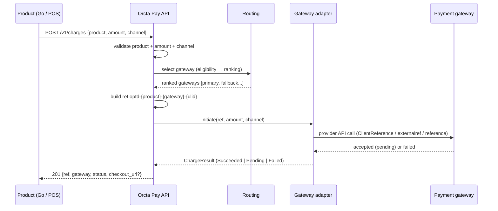
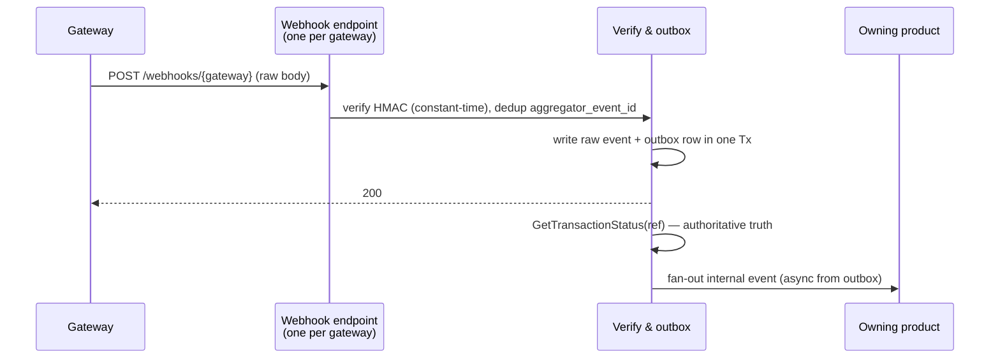

# Orcta Pay — Payments Service Design

Status: **Draft v1** — Last updated 2026-08-31. Companion to [`ARCHITECTURE.md`](./ARCHITECTURE.md) and [`ADR-034`](./docs/adr/0034-orcta-pay-service.md) / [`ADR-035`](./docs/adr/0035-payments-outbox-reservation-ledger.md). Sources: `orcta-pay.pdf` (service), `orctago-payments-domain-design (2).md` (hardening), `docs/research/hubtel-moolre-paystack-deep-dive.md`.

Orcta Pay is a standalone internal service that owns all gateway integration. Products (`orctago`, `pos`) call one API and never touch a provider directly.

## 1. Scope

Orcta Pay serves every Orcta product through one API. It hides gateway selection, reference generation, ledger posting, and reconciliation behind that API.

In scope: MoMo collections via aggregator, vendor disbursements (batch payout net of commission), double-entry ledger, webhook ingestion, daily reconciliation, provider routing and failover.

Out of scope: card acceptance and any PCI-scoped flow. No code path accepts, logs, or stores PAN, CVV, or expiry. A future card path must use a hosted or semi-integrated provider that keeps raw card data off Orcta infrastructure.

The service is aggregator-agnostic at its boundary. `Hubtel`, `Moolre`, and `Paystack` are adapters behind one sealed interface. Adding a gateway adds an adapter, not a new product contract.

## 2. Architecture

### 2.1 Request flow (outbound)

A product calls `POST /v1/charges` with `product`, `amount_pesewas`, and recipient. Orcta Pay routes to a ranked adapter and initiates the charge. The product receives an Orcta Pay-native response regardless of the underlying gateway.



Reference `optd-{product}-{gateway}-{ulid}` is generated at intent creation. It is passed as the gateway's idempotency key on every attempt, including retries and sync failover. It is the sole attribution mechanism for inbound webhooks.

### 2.2 Webhook flow (inbound)

Each gateway posts to one Orcta Pay endpoint for that gateway. Product attribution comes from the `optd-...` reference embedded in the event, not from gateway-side routing.



The handler returns 200 as soon as the raw payload is durably stored. Processing and fan-out happen asynchronously so a slow downstream step cannot cause the gateway to time out and redeliver.

### 2.3 Gateway adapters

Each provider implements one sealed interface. Gateway-specific HTTP shape, auth header, and amount encoding stay inside the adapter.

```go
type AggregatorClient interface {
    Initiate(ctx context.Context, req InitiateRequest) (InitiateResponse, error)
    Verify(ctx context.Context, reference string) (VerifyResult, error)
    Refund(ctx context.Context, reference string, amount money.Money) error
    Payout(ctx context.Context, recipient string, amount money.Money, reference string) error
}
```

`InitiateResponse` and `VerifyResult` feed a sealed `ChargeResult` (`Succeeded` | `Pending` | `Failed`). Sealing forces exhaustive handling at every call site.

| Dimension | Hubtel | Moolre | Paystack |
|---|---|---|---|
| Base URL | `https://payproxyapi.hubtel.com` | `https://api.moolre.com` (sandbox `https://sandbox.moolre.com`) | `https://api.paystack.co` |
| Amount on wire | Decimal GHS (`"50.00"`) | Decimal GHS string (`"120.00"`) | Integer pesewas (`50000`) |
| Idempotency key | `ClientReference` | `externalref` | `reference` |
| Auth | `Basic base64(id:secret)` | `X-API-USER` + `X-API-PUBKEY` / `X-API-KEY` | `Bearer sk_...` |
| Webhook signature | Not published — confirm | Not published — use dedup + `Verify` | `x-paystack-signature` HMAC SHA512 over raw body |

Adapters handle wire conversion. Callers always use `money.Money` (integer pesewas).

### 2.4 Routing

Routing has three independent stages. Each is tuned separately.

Eligibility filters gateways to a candidate list per request. The check is a static, versioned capability table.

| Signal | Example | Effect |
|---|---|---|
| Channel support | `mtn-gh` vs `vodafone-gh` | Exclude unsupported gateways |
| Amount min/max | Provider floor/ceiling | Exclude out-of-range requests |
| Currency | `GHS` only v1 | Exclude non-GHS candidates |
| Product restriction | POS-only gateway | Exclude per product |

An empty candidate list fails fast. It never silently defaults.

Ranking scores remaining candidates. Start with one rule: success-rate floor then cost tiebreak. Add weighting only after production data justifies it.

| Signal | Source | How it ranks |
|---|---|---|
| Rolling success rate per gateway/channel | Valkey | Hard floor — below threshold is excluded, not deprioritized |
| Cost | Static per-gateway basis points + fixed fee | Tiebreak among gateways that clear the floor |
| Circuit-breaker state | Valkey | Open circuits are excluded from ranking entirely |

Ranking data is read-heavy and frequently updated. Valkey stores rolling success rate, p95 latency, and breaker state. Eligibility config is versioned static config.

Failover differs by timing.

| Failure type | What happens |
|---|---|
| Synchronous (`Initiate` errors) | Retry immediately against the next-ranked eligible gateway — no charge has occurred yet |
| Asynchronous (`Initiate` succeeded, webhook never arrives or arrives `Failed`) | Do not retry on a different gateway in the same flow — reconcile via `GetTransactionStatus` on timeout instead; retrying risks double-charging a customer who approved the first prompt |

Each gateway is wrapped in a circuit breaker. Consecutive failures or an error-rate threshold opens the circuit. Half-open probes after cooldown. An outage is detected once and routed around for every subsequent request.

## 3. Data model (sketch)

```sql
payment_intents        id uuid PK, ref text UNIQUE, -- optd-{product}-{gateway}-{ulid}
                       product text, gateway text, amount_pesewas bigint,
                       status enum('pending','confirmed','failed'),
                       idempotency_key text, created_at timestamptz

gateway_events         id uuid PK, intent_ref text FK, kind enum('charge','disbursement'),
                       status enum('pending','dispatched','confirmed','failed'),
                       raw_request jsonb, raw_response jsonb,
                       retry_count int, created_at timestamptz, dispatched_at timestamptz

ledger_entries         id uuid PK, product text, wallet text,
                       entry_type enum('credit','debit'),
                       amount_pesewas bigint, reason enum('order_payment','commission_deduction','payout','adjustment'),
                       ref text, value_time timestamptz, booking_time timestamptz, settlement_time timestamptz NULL

payout_batches         id uuid PK, product text, batch_date date,
                       status enum('running','completed','partially_failed'),
                       idempotency_key text, created_at timestamptz, completed_at timestamptz NULL

payout_reservations    id uuid PK, batch_id uuid FK, vendor_id uuid,
                       amount_pesewas bigint, status enum('open','settled','released'),
                       created_at timestamptz, resolved_at timestamptz NULL

webhook_inbox          id uuid PK, aggregator_event_id text UNIQUE NOT NULL,
                       gateway text, payload jsonb, received_at timestamptz, processed_at timestamptz NULL
```

`ledger_entries` carries three timestamps. `value_time` is when the event occurred. `booking_time` is when Orcta Pay recorded it. `settlement_time` is when funds moved at the aggregator — null until `Verify` or reconciliation confirms it. Collapsing these loses the ability to report against the correct period and to distinguish backfill from settlement.

Idempotency for payouts is scoped to `(vendor_id, batch_date)` so a resumed batch cannot double-pay.

## 4. Idempotency and outbox

No handler performs a synchronous aggregator call. Every charge or disbursement intent is written to the outbox in the same database transaction as the triggering state change. A worker polls and dispatches.

`idempotency_key` is generated at intent creation and passed as the gateway's `reference`/`externalref` on every attempt, including retries. The `UNIQUE (product, idempotency_key)` constraint is the source of truth, not the gateway's dedup.

Valkey `SETNX` with TTL guards the race between the outbox worker and a manual retry. It is a lock, not durability. The outbox table remains the source of truth.

Every outbound call persists verbatim `raw_request` and `raw_response` keyed to the outbox entry, separate from the parsed `ChargeResult`. This allows reprocessing after a parsing bug without replaying the call.

## 5. Funds reservation

Before a disbursement dispatches, Orcta Pay reserves the vendor's available balance. The balance check and reservation creation occur in one linearizable transaction.

A reservation moves `open` → `settled` (disbursement confirmed, ledger entry posted) or `open` → `released` (permanent failure, funds return to available). An `open` reservation past the threshold is a monitored alert, not a silent state.

Available balance is total ledger sum minus open reservations. No mutable balance column exists. A vendor balance is a computed sum over ledger rows, never a stored value.

Negative balances are representable. A reversal or correction arriving after a payout has disbursed can drive a vendor negative. No `CHECK (balance >= 0)` exists on any derived view. Negative balances are recovered by netting against the next payout or via an explicit compensating entry.

## 6. Webhook handling

The webhook is a trigger, not truth. The payload is never posted directly to the ledger.

1. Verify HMAC over raw bytes with constant-time compare. Reject unsigned or mismatched payloads with a logged 401. Moolre has no published signature — dedup plus `GetTransactionStatus` is the check.
2. Dedup by `aggregator_event_id` in `webhook_inbox` (`UNIQUE`). Redelivery is expected, not anomalous. Duplicate deliveries return 200 without reprocessing.
3. Ack 200 as soon as the raw payload is durably stored. Process asynchronously.
4. Call `GetTransactionStatus(reference)` for authoritative state. If the aggregator lags, retry the query — do not fall back to the webhook payload.
5. On confirmed status, transition the outbox entry and write the ledger entry in one transaction.

Absence of a webhook within the expected window is a valid `pending` state, not an error. A backstop reconciliation poll covers webhooks that never arrive.

## 7. Reconciliation

A standing daily job pulls each aggregator's settlement/transaction statement and diffs it against `ledger_entries` for the period.

| Concern | Behavior |
|---|---|
| Invariant per closed period | `sum(ledger debits + credits) + sum(platform_commission) + aggregator net = 0` |
| Mismatch | Alert — never auto-overwrite; correct with a linked compensating entry |
| Settlement window | Model `T+1` to `T+3` per aggregator so unsettled transactions are not flagged as mismatches |
| Correction style | New compensating row linked to the original, not an edit or delete |

Statement sources: Moolre `POST /open/account/status` type 2 filtered by date, Paystack `GET /settlement` + `GET /settlement/:id/transactions`, Hubtel — confirm reporting API and join key (`ClientReference` vs `TransactionId`) with provider.

Reconciliation is the backstop for a missed webhook, a ledger write that failed after verification, or a divergence between webhook and statement truth.

## 8. Controls

| Action | Control |
|---|---|
| Manual ledger correction or compensating entry | Requires a second approver distinct from the requester |
| Manual release of an `open` payout_reservation | Four-eyes + audit trail |
| Change to vendor commission rate | Four-eyes + audit trail |
| Manual retry of a `failed` outbox entry or `partially_failed` batch | Four-eyes + audit trail |

An explicit audited override path exists for emergencies. Access to production payment data and aggregator credentials is granted by role, not per person, and grant/revoke is itself logged.

## 9. Observability

Dashboards are release-blocking for the payments service. Payment failures are silent until a vendor or customer reports a discrepancy.

| Panel | Signal |
|---|---|
| Payment success rate | Charge attempts vs `Verify`-confirmed |
| Webhook delivery lag | Gateway send time to Orcta Pay receipt time |
| Reconciliation mismatch count | Mismatches per period per gateway |
| Disbursement batch time and failure rate | Per-batch duration and `partially_failed` share |
| Circuit breaker transitions | Trips per gateway/channel, time in open |
| Open reservations | Count and age past the resolution threshold |

Domain packages never import OTel or Prometheus directly. They use `internal/observability` (`LoggerFromContext`, `StartSpan`) so the backend can change without rippling through domains.

## 10. Open decisions

| Decision | Options | Default until decided |
|---|---|---|
| Transport | REST with OpenAPI vs gRPC (+ gRPC-Web proxy for browsers) | REST — OpenAPI is the wire contract; add gRPC alongside for backend-to-backend only if needed |
| Service-to-service auth | mTLS vs short-lived JWT vs API key per product | Short-lived JWT scoped to `product` — decided before production cutover |
| Ranking weights | Success-rate floor value, cost tiebreak thresholds, latency weight | Success-rate floor then cost only — tune from production data |
| Reservation resolution threshold | How long an `open` reservation stays valid before alert | Set from sandbox confirmation latency once measured |
| Settlement cadence per gateway | Hubtel T+?, Moolre daily cut-off, Paystack `T+1`/`T+2` business days | `T+3` reconciliation window until each provider confirms in writing |

Card remains out of scope until a PCI-certified provider path is chosen that keeps raw card data off Orcta infrastructure. That choice is structural, not per-adapter.

