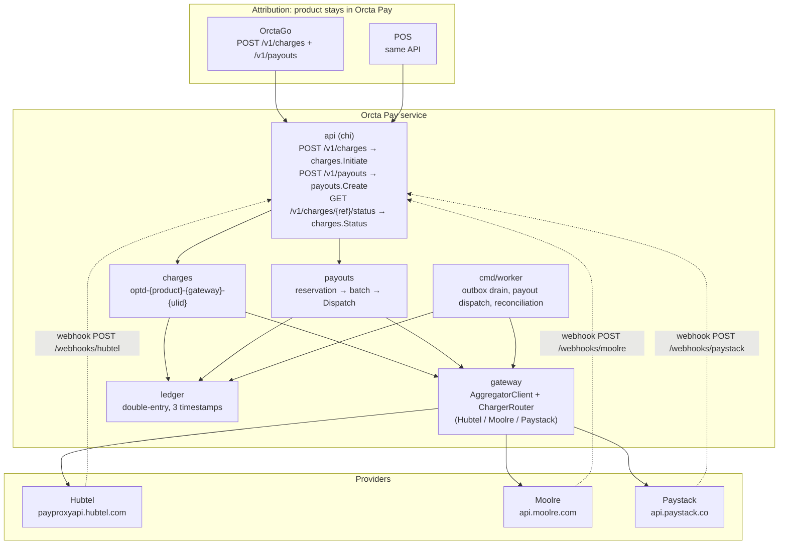
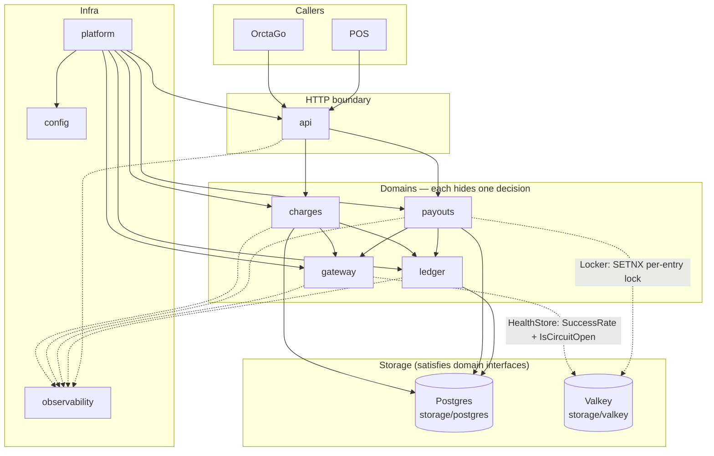

# Orcta Pay — architecture diagrams

Status: **Draft v1** — dependency graph reflects `ARCHITECTURE.md:2` and `ARCHITECTURE.md:5` as of 2026-08-31. Domain-specific diagrams (charge status machine, payout batch state, per-gateway HTTP trace) live inside their own design or adapter docs, not here. This doc is reserved for cross-cutting, whole-system views that do not belong to any single domain.

Companion doc: [`ARCHITECTURE.md`](./ARCHITECTURE.md) — §2, §4, §5, §15. This diagram doc is the visual form of those sections, kept in sync manually because Mermaid is not generated from the Go interfaces automatically.

---

## 1. Overall system — products to gateways

How a request moves from a product through Orcta Pay to a provider.



Product attribution uses `optd-{product}-{gateway}-{ulid}` passed as `reference` / `clientReference` / `externalref` on every attempt, including retries and fallback. Gateway-side routing is not relied upon.

---

## 2. Package dependency graph

A solid arrow means "calls into, via an interface the arrow's source declares." A dotted arrow marks Valkey-mediated ranking or locking. No domain package imports the thing that consumes it.



**What this makes visible that the table did not:** `gateway` has no outgoing arrow into any domain — it is a leaf that touches providers and Valkey, nothing domain-specific above it. `charges` and `payouts` both depend on `gateway` and `ledger` but not on each other. That means payout policy can change without re-verifying charge logic and vice versa. `api` is a pure sink with no dependents — it translates HTTP to domain calls and nothing imports it. `ledger` depends only on `storage/postgres`, so accounting corrections do not risk gateway regressions. If a future change ever adds an arrow from `ledger` into `gateway`, from `charges` into `payouts`, or into `api`, that is worth noticing precisely because the diagram currently has none.

---

## 3. Deployment topology — one VPS today

How code reaches the VPS and how traffic reaches the service.

```mermaid
graph TD
    subgraph External["Outside the VPS"]
        GHCR["GHCR<br/>ghcr.io/orctatech-engineering-team/orcta-pay:&lt;sha&gt;"]
        Vault["Vault<br/>renders .env at provision time"]
        Products3["OrctaGo + POS<br/>HTTPS clients"]
        GwExt["Hubtel / Moolre / Paystack<br/>collect + disburse + Verify + webhooks"]
    end

    subgraph VPS["VPS — Contabo"]
        subgraph Data["deploy/data/ — long-lived, separate compose project"]
            PG[(Postgres)]
            VK[(Valkey)]
        end

        subgraph App["deploy/app/ — per-release (Kamal blue/green)"]
            Proxy[kamal-proxy<br/>probes GET /healthz]
            Migrate[migrate<br/>gateway init container]
            Web[web<br/>cmd/api :8080]
            Worker[worker<br/>cmd/worker]
        end

        Caddy["Caddy :443<br/>TLS + X-Forwarded-For"]
    end

    Products3 --> Caddy --> Proxy --> Web
    Proxy --> Worker
    Web --> PG
    Web --> VK
    Worker --> PG
    Worker --> VK
    Migrate --> PG
    Web -.->|depends_on: migrate succeeded| Migrate
    Worker -.->|depends_on: migrate succeeded| Migrate

    Vault -.->|render .env| Web
    Vault -.->|render .env| Worker

    Web --> GwExt
    GwExt -.->|POST /webhooks/{gateway}| Caddy

    GHCR --> Orcta["Orcta Runtime<br/>GHCR webhook → pull + swap"]
    Orcta --> Proxy
```

Request path is product → Caddy → kamal-proxy → `cmd/api` → `charges`/`payouts` → `gateway` → provider, with `storage/postgres` and `storage/valkey` alongside. Webhook path is provider → Caddy → `api/webhooks` → `webhook_inbox` → `gateway.Verify` → `ledger`. Both domain calls carry `context.Context` with `trace_id`; `gateway` ranking reads `storage/valkey` but domain packages never import a Valkey client directly.

Deploy is pull-based: `master` → CI → `ghcr.io/...:<sha>` → GHCR webhook → Orcta pulls on the VPS and swaps via Kamal. Datastores live in `deploy/data/` — not in the app's compose project — so a deploy never gets a fresh empty volume (`ARCHITECTURE.md:15`). Secrets are rendered from Vault to `.env` at provision time. `deploy/app/docker-compose.yml` is authoritative for provisioning. `migration-policy.md` is authoritative for DDL safety.

---

## 4. Open for next session

1. **Keeping this in sync** — nothing enforces that these diagrams match the domain prose as it evolves. Add a checklist item to `ORCTA_DOCUMENTATION_GUIDE.md` reminding whoever edits a dependency to check whether these diagrams need the same edit.
2. **Which domain-specific diagrams to build next** — three remain, in rough order of value: the charge status and retry state machine for `payment_intents` (`pending → succeeded/failed` plus webhook-vs-Verify timing) in `charges`-design; the payout batch state machine (`pending → processing → completed/partially_failed`) plus reservation lifecycle (`open → settled/released`) with the resumability gate in `payouts`-design; and the per-gateway HTTP trace (wire field mapping: pesewas vs decimal GHS, header names, bulk loop shape) in the gateway adapter spec. The overall system, package dependency, and deployment views here are done.

